# Exemplo de Monorepo com Flutter

## Tecnologias/bibliotecas

Algumas das tecnologias/bibliotecas utilizadas no projeto foram:

 - Flutter toolkit 2.5.3 (stable)
 - Dart sdk 2.14.4
 - flutter_modular 4.0.0+8
 - argon2: 1.0.1
 - uuid: 3.0.5
 - flutter_triple: 1.2.4+3
 - kt_dart: 0.9.1
 - fpdart: 0.0.10
 - responsive_framework: 0.1.4
 - rxdart: 0.27.2
 - dart_code_metrics 4.2.1
 - lint 1.7.2
 - freezed: ^0.14.5
 - flutter_launcher_icons 0.9.2
 - flutter_native_splash 1.3.1

Além dessas, há também outras bibliotecas. O pubspec.yaml de cada aplicação/produto possui a lista completa das bibliotecas utilizadas.

## O que é Monorepo?

Resumidamente, Monorepo é um repositório de código (seja do Github, Gitlab, Bitbucket ou outros) único de um projeto de software.

No entanto, isso não significa que estamos falando de um projeto monolito clássico, em que todos os serviços, módulos, componentes, bibliotecas e etc, estão alocados em um único "guarda-chuva" estrutural, seja uma estrutura orientada por um framework ou uma estrutura própria.

Muito pelo contrário, um projeto Monorepo caracteriza-se justamente pela separação destas partes em projetos individuais, porém conectados entre si (seja por chamada diretamente no código ou usando algum software de mensageria como no caso de microsserviços) e compartilhando o mesmo repositório.

## Sobre o projeto

Este projeto apresenta um modelo conceitual de uma família de produtos que, nesse caso, é composto por um produto de email (Mail App) e um outro produto de armazenamento de arquivos (Drive App). Obs: qualquer semelhança com o google é mera coincidência ;) .

### Aviso importante

Esclarecendo desde já que nenhum desses produtos são funcionais e sim apenas modelos conceituais. Alguns dados usados estão em memória e outros poucos são persistidos e não há requisição a APIs. 

Por este motivo, esse projeto não possui testes. Portanto, apesar do uso de alguns conceitos de SOLID, Clean Code e Clean Architecture, esse projeto não tem como motivação ser exemplo de boas práticas de desenvolvimento de software, mas somente um modelo de como construir um produto através do encaixe de múltiplas aplicações.

O autor desse projeto defende o uso de testes na construção de softwares. Basta olhar os outros projetos disponibilizados no Github. Todos possuem testes, sobretudo em suas camadas mais sensíveis. O não uso dos testes neste projeto ocorre devido ao caráter conceitual e não funcional das aplicações. Se em algum momento esse repositório for usado como molde para um projeto real, NÃO DEIXE DE REALIZAR OS TESTES.

### Aplicação e produto/aplicativo

Este projeto está dividido em 6 partes, que dividiremos em dois grupos: <b> aplicação</b> e <b>produto/aplicativo</b>

#### Aplicação

Temos 4 aplicações, utilizadas na construção do produto Mail App e Drive App. 

##### flutter_mail_and_drive_modules 

As bibliotecas que usadas por todo o projeto estão registradas e disponibilizadas nessa aplicação. Dessa forma se uma dada biblioteca tiver uma nova versão disponível para a correção de problema de bug ou desempenho, a correção será refletida por todo o projeto. Assim como o efeito contrário também se aplica. Caso uma outra versão trouxer algum problema, esse também será refletido por todo o projeto.

Por isso é necessário uma atenção especial: as diferenças entre as versões de uma biblioteca (seja upgrade ou downgrade), comumente chamado de <i>breaking change</i>, precisa ser muito bem estudado e debatido entre os membros da equipe do projeto, principalmente a relação esforço de refatoração versus benefícios proporcionados.

##### flutter_mail_and_drive_core

A aplicação core é responsável por "códigos" compartilhados por todo o projeto, mas que não se encaixa como "nativa" em nenhuma das aplicações ou produtos disponíveis. 

Por exemplo, a classe <i>EmailValue</i> (<i>value object</i> para a validação da sintaxe de email) é usada tanto na aplicação de login quanto no produto Mail App. No entanto, não parece ser apropriado armazenar o código de <i>EmailValue</i> em login ou em Mail App. Nesse caso, o core mostrou-se como a melhor opção.

##### flutter_mail_and_drive_design_system

A aplicação do design system é responsável pela identidade visual da aplicação de login e dos produtos Mail App e Drive App. É tudo o que está relacionado com a parte visual do projeto, desde a cor de fundo, cor e formato dos botões, cor e formato dos campos de textos, entre outros, está configurado nessa aplicação. 

Até mesmo o botão para a troca do tema (claro ou escuro), localizado no topo, é um widget pertencente a essa aplicação, bem como a persistência do tema escolhido, ou seja, caso o usuário escolha utilizar o tema claro, quando o aplicativo for aberto em um outro momento, este será o tema carregado.

Botão para trocar o tema claro para o escuro.

Botão para trocar o tema escuro para o claro.

E é nessa aplicação que talvez esteja a grande sacada desse projeto, sobretudo na mudança do tema. Vamos supor que queremos criar uma linha de aplicativos de jogos infantis, com o tema de super-heróis, separados em dois grupos, DC e Marvel, e que a criança pudesse escolher o seu grupo preferido, escolhendo o grupo Marvel, por exemplo.

Agora vamos imaginar que um desses jogos criados fosse o [super trunfo](https://pt.wikipedia.org/wiki/Super_Trunfo). Pense em uma disputa entre a carta do Homem-Aranha e a carta do Hulk e que o atributo escolhido fosse agilidade, com a vitória do Homem-Aranha. Nisso entraria uma comemoração de cerca de 5 a 7 segundos, com o tema do Homem-Aranha, com uma foto de fundo e as cores do jogo em vermelho e azul (cores do Homem-Aranha). Em seguida o aplicativo voltaria ao seu tema original e as disputas continuariam. E seria assim para outros heróis e em outros jogos também.

Da forma como o projeto foi desenvolvido, esse tipo de customização torna-se altamente viável. É possível criar diferentes temáticas para os mais diversos tipos de projetos, enriquecendo muito a experiência do usuário.

##### flutter_mail_and_drive_login

Dentre as aplicações, esse é o que mais se aproxima de ser um produto, devido as seguintes características:

1. Tela
2. Validações
3. Simulação de funcionalidade
4. Persistência de dados

Talvez na grande maioria de outros projetos, poderia ser um produto de gerenciamento de usuário. Neste ficou restrito a uma aplicação de login.

<b> 1. Tela </b>

A tela traz no cabeçalho um logo que simboliza o grupo de produtos desse projeto. Logo abaixo os campos para informar o email e a senha, seguido do botão de envio para verificação. 

Layout no formato retrato.

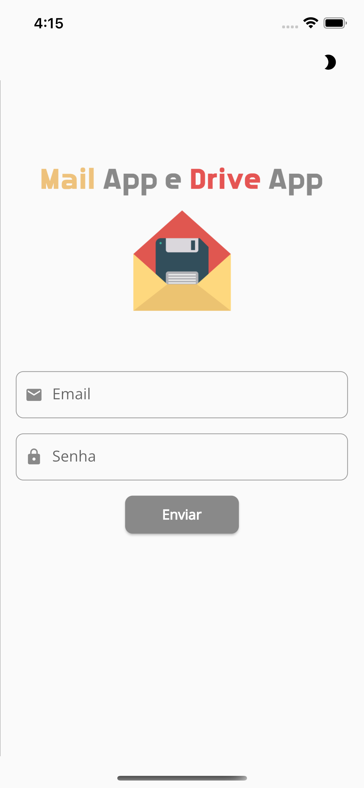

Layout no formato paisagem.

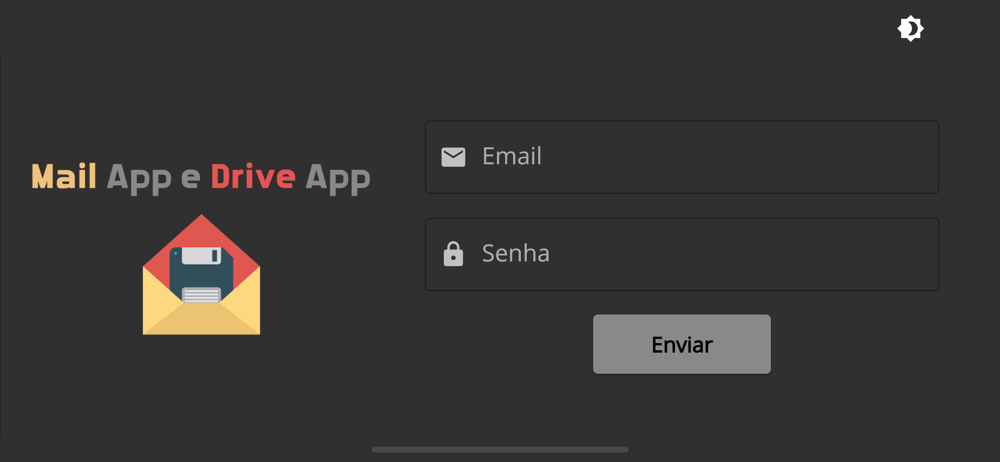

<b> 2. Validações </b>

A única validação presente nessa aplicação é a senha, onde é obrigatório conter um caractere maíusculo, um minúsculo, um número e um símbolo, além do tamanho mínimo de 8 caracteres.

A validação da sintaxe de email, que no início do projeto estava contido nessa aplicação, foi transferido para o core, pois também é utilizado em Mail App.

  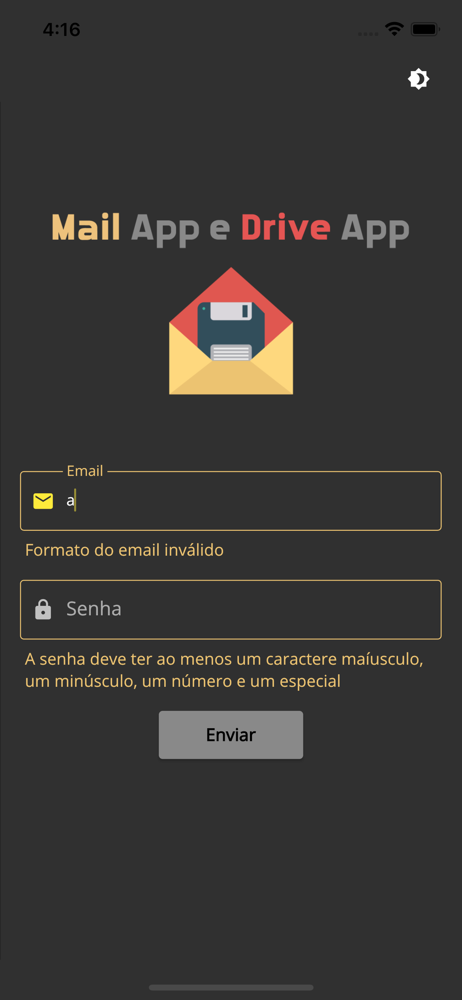
  

<b> 3. Simulação de funcionalidade </b>

Simulação de funcionalidade significa que existe uma verificação implementada, mas não é real, ou seja, não existe uma chamada à api para autenticação, que retorna um token de acesso, ou status de não autorização.

O que tem implementado é a geração de um número aleatório, que, se for par, o email e senha estão corretos, se for ímpar, o email e senha estão incorretos.

Uma implementação altamente simplista, que apenas reforça o caráter conceitual do projeto.

  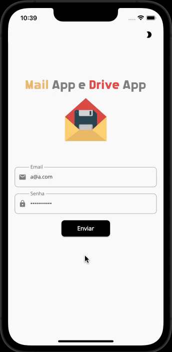
  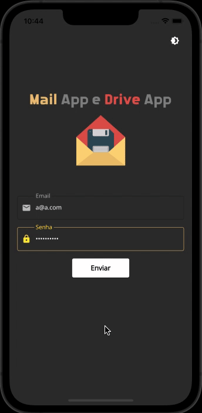

<b> 4. Persistência de dados </b>

A persistência está no armazenamento do token na base de dados do dispositivo, possibilitando mostrar a identidade do usuário logado nos produtos (Mail App e Drive App), além da possibilidade de manter a sessão ao abrir o aplicativo posteriormente, acessando os dados sem a necessidade de realizar o login novamente, a não ser que o usuário faça o logout.

#### Produto/aplicativo

##### flutter_mail_app (Mail App) 

É um produto para simular o gerenciamento de email. Basicamente o aplicativo fornece quatro tipos de tabelas de emails fictícios: Meu emails (inbox), enviados, rascunho e lixeira. 

Cada tabela fornece a possibilidade de realizar a navegação entre os dados, além da pesquisa de um email de interesse através de um termo de busca. Essa pesquisa engloba os seguintes dados: de/para, assunto e mensagem. A data do email não está contida na busca.

A grande sacada disso está no uso dos mesmos componentes de tabela, navegação e pesquisa para todos os tipos de emails. A troca dos dados ocorre através do uso do <i>design pattern</i> injeção de dependência, onde cada tipo de dado tem sua própria classe, e todas são implementadas usando uma mesma classe abstrata, e para cada tipo de dado escolhido, a respectiva classe é injetada na classe do repositório responsável pela listagem.

Com isso, correção de erros, melhorias e implementação de novas funcionalidades serão refletidas para todo o tipo de dados automaticamente.

Além disso, também é possível "enviar" um email. Claro, de forma simples, somente texto, sem a possibilidade de anexar arquivos, imagens, videos.

  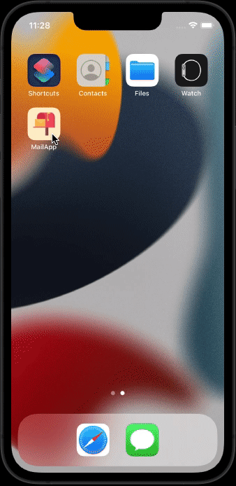
  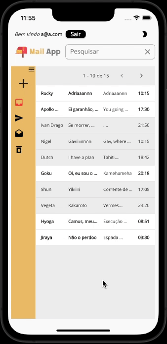
  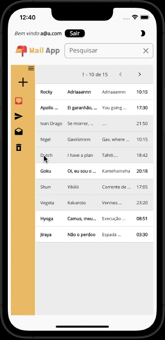
  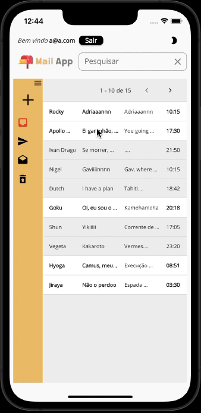
  

Ao fechar o aplicativo e abrir posteriormente, recupera-se a sessão de login e a cor do tema, pois ambas estão na memória do dispositivo. Cada armazenamento está implementado em suas respectivas aplicações.

##### flutter_drive_app (Drive App) 

É um produto para simular o repositório de arquivos. Este é um aplicativo até mais simples do que o Mail App. Enquanto o Mail App possui até mesmo uma simulação de envio de email, o Drive App ficou restrito somente a visualização de "arquivos".

No entanto, o Drive App faz muito bem o seu papel ao ser comparado com o Mail App, que é mostrar a identidade visual dos produtos, resultado da estratégia de separar o layout em uma aplicação própria.

Assim como nas tabelas do Mail App, cada lista de arquivos compartilha o mesmo código, tanto na listagem em si quanto na busca. A troca dos dados também ocorre através da injeção de dependência, onde, para cada opção escolhida, a respectiva classe contendo os dados estáticos é injetada na classe do repositório responsável pela listagem.

  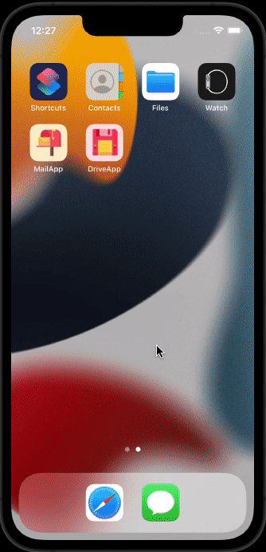
  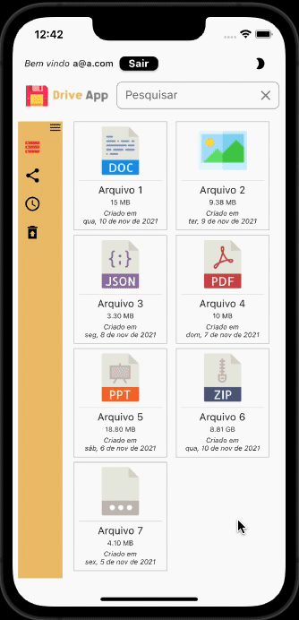
  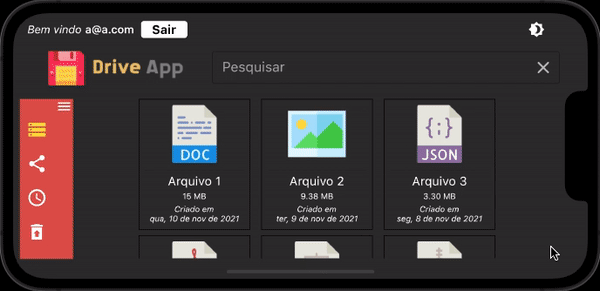

Assim como no Mail App, ao fechar o aplicativo e abrir posteriormente, recupera-se a sessão de login e a cor do tema, pois ambas estão na memória do dispositivo. Cada armazenamento está implementado em suas respectivas aplicações.

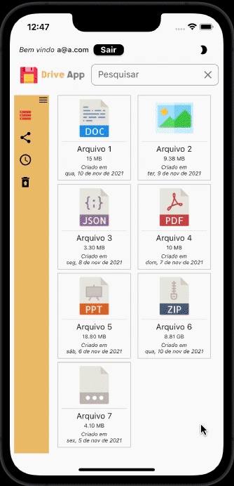

## Considerações finais

Relembrando, esse é apenas um modelo de um projeto Monorepo, onde temos dois produtos, o Mail App e o Drive App e quatro aplicações que auxiliam na construção desses dois produtos: a aplicação de login, de layout, de core para funcionalidades compartilhadas e, por fim, a aplicação para registro e compartilhamento de bibliotecas.

Todos os dados são fictícios, assim como a validação de login e senha. Por esse motivo, o projeto não possui testes, prática essa não recomendada, sobretudo em projetos verdadeiramente funcionais e para produção. Caso em algum momento esse projeto seja usado como molde para desenvolvimento, acrescente os testes.

Por fim, acredita-se que o principal próposito foi alcançado: um exemplo de construção de aplicativos de forma modularizada onde o login está centralizado em um lugar, a configuração de layout está em outro, e ambos são compartilhados entre os produtos, oferecendo comportamentos e identidades semelhantes.

## Ícones

Icons made by <a href="https://www.freepik.com" title="Freepik">Freepik</a> from <a href="https://www.flaticon.com/" title="Flaticon">www.flaticon.com</a>
