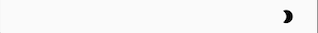
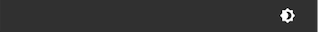
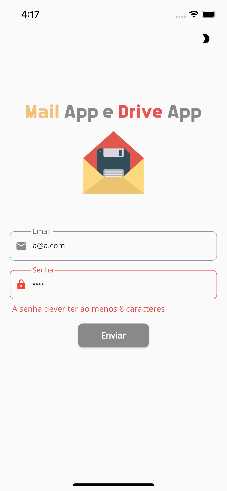
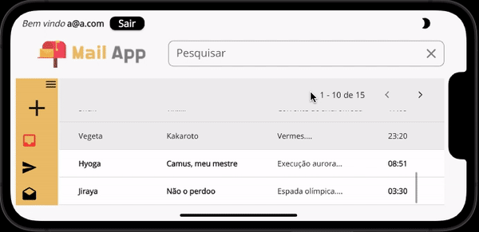

# Exemplo de Monorepo com Flutter

## O que é Monorepo?

Resumidamente, Monorepo é um repositório de código (seja do Github, Gitlab, Bitbucket ou outros) único de um projeto de software.

No entanto, isso não significa que estamos falando de um projeto monolito. Monolito é um projeto em que todos os serviços, módulos, componentes, bibliotecas e etc... estão alocados em um único "guarda-chuva" estrutural, seja uma estrutura orientada por um framework ou uma estrutura própria.

Muito pelo contrário, um projeto Monorepo caracteriza-se justamente pela separação destas partes em projetos individuais, porém conectados entre si (seja por chamada diretamente no código ou usando algum software de mensageria) e compartilhando o mesmo repositório.

## Sobre o projeto

Este projeto apresenta um modelo conceitual de uma família de aplicativos que, nesse caso, é composto por um aplicativo de email e um outro aplicativo de armazenamento de arquivos (drive). Obs: qualquer semelhança com o google é mera coincidência ;) .

### Aviso importante

Esclarecendo desde já que nenhum desses aplicativos (email e drive) são funcionais e sim apenas modelos conceituais. Todos os dados usados estão em memória e sem persistência alguma, nem requisição a APIs. 

Por este motivo, esse projeto não possui testes. Portanto, apesar do uso de alguns conceitos de SOLID, Clean Code e Clean Architecture, esse projeto não tem como motivação ser exemplo de boas práticas de desenvolvimento de software, mas somente um modelo de como construir um produto através do encaixe de múltiplas aplicações auxiliares.

O autor desse projeto defende o uso de testes na construção de softwares. Basta olhar os outros projetos disponibilizados no github. Todos possuem testes, sobretudo em suas partes mais sensíveis. O não uso dos testes neste projeto ocorre devido ao caráter conceitual e não funcional das aplicações. Se em algum momento esse repositório for usado como molde em uma projeto real, NÃO DEIXE DE INCLUIR OS TESTES.

### As aplicações

Este projeto tem um total de 6 aplicações, que dividiremos em dois grupos: <b>produto</b> e <b> aplicações</b>

#### Aplicações

Temos 4 aplicações auxiliares. São aplicações utilizadas tanto na construção do produto Mail App, quanto no Drive App. 

##### flutter_mail_and_drive_modules 

Bibliotecas que serão usadas por todo o projeto estarão registradas e disponibilizadas nessa aplicação. Dessa forma é garantido que, se uma dada biblioteca tiver uma nova versão disponível para a correção de problema de bug ou desempenho, a atualização dessa biblioteca refletirá por todo o projeto.

No entanto, é necessário uma atenção especial: as diferenças entre as versões de uma biblioteca (seja upgrade ou downgrade), comumente chamado de <i>breaking change</i>, precisa ser muito bem estudado e debatido entre os membros da equipe do projeto, principalmente a relação esforço de refatoração versus benefícios proporcionados.

##### flutter_mail_and_drive_core

A aplicação core é responsável por "códigos" compartilhados por todo o projeto, mas que não se encaixa como "nativa" em nenhuma das aplicações ou produtos disponíveis. 

Por exemplo, a classe <i>EmailValue</i> (<i>value object</i> para a validação de dados de email) é usada tanto na aplicação de login quanto no produto Mail App. No entanto, não parece ser apropriado armazenar o código de <i>EmailValue</i> em login ou em Mail App. Nesse caso, o core mostrou-se como a melhor opção.

##### flutter_mail_and_drive_design_system

A aplicação do design system é responsável pela identidade visual do aplicativo de login e dos produtos Mail App e Drive App. É tudo o que está relacionado com a parte visual do projeto, desde a cor de fundo, cor e formato dos botões, cor e formato de textfields, entre outros, está configurado nessa aplicação. 

Até mesmo o botão para a troca do tema (claro ou escuro) localizado no topo é um widget pertencente a essa aplicação, bem como a persistência do tema escolhido, ou seja, caso o usuário escolha utilizar o tema claro, quando o aplicativo for aberto em um outro momento, este será o tema carregado.

Botão para trocar o tema claro para o escuro.

Botão para trocar o tema escuro para o claro.

E é nessa aplicação que talvez esteja a grande sacada desse projeto, sobretudo na mudança do tema. Vamos supor que queremos criar uma linha de aplicativos de jogos infantis, com o tema de super-heróis, separados em dois grupos, DC e Marvel, e que a criança pudesse escolher o seu grupo preferido, escolhendo o grupo Marvel.

Agora vamos imaginar que um desses jogos criados fosse o [super trunfo](https://pt.wikipedia.org/wiki/Super_Trunfo). Pense em uma disputa entre a carta do Homem-Aranha e a carta do Hulk e que o atributo escolhido fosse agilidade, com a vitória do Homem-Aranha. Depois disso entraria uma comemoração de cerca de 5 a 7 segundos, com o tema do Homem-Aranha, com uma foto de fundo e as cores do jogo em vermelho e azul. Em seguida o aplicativo voltaria ao seu tema original e as disputas continuariam. E seria assim para outros heróis e em outros jogos também.

Da forma como o projeto foi desenvolvido, esse tipo de customização torna-se altamente viável. É possível criar diferentes temáticas para os mais diversos tipos de projetos, enriquecendo muito a experiência do usuário.

##### flutter_mail_and_drive_login

Dentre os aplicativos, esse é o que mais se aproxima de ser um produto, devido as seguintes características:

1. Tela
2. Validações
3. Simulação de funcionalidade
4. Persistência de dados

Talvez na grande maioria de outros projetos, poderia ser um produto de gerenciamento de usuário. Neste ficou restrito a um aplicativo de login.

<b> 1. Tela </b>

A tela traz no cabeçalho um logo que simboliza o grupo de produtos desse projeto. Logo abaixo os campos para informar o email e a senha, seguido do botão de envio para validação. 

Layout no formato retrato.

Layout no formato paisagem.

<b> 2. Validações </b>

A única validação presente nesse aplicativo é a senha, onde é obrigatório conter um caractere maíusculo, um minúsculo, um número e um símbolo, além do tamanho mínimo de 8 caracteres.

A validação da sintaxe de email, que no início do projeto estava contido nesse aplicativo, foi transferido para o core, pois também é utilizado em Mail App.

  
  

<b> 3. Simulação de funcionalidade </b>

Simulação de funcionalidade significa que existe uma verificação implementada, mas não é real, ou seja, não existe uma chamada à api para autenticação, que retorna um token de acesso, ou status de não autorização.

O que tem implementado é a geração de um número aleatório, que, se for par, o email e senha estão corretos, se for ímpar, o email e senha estão incorretos.

Uma implementação altamente simplista, que apenas reforça o caráter conceitual do projeto.

  
  

<b> 4. Persistência de dados </b>

A persistência está no armazenamento do token na base de dados do dispositivo, possibilitando mostrar a identidade do usuário logado nos produtos (Mail App e Drive App), além da possibilidade de manter a sessão ao abrir o aplicativo posteriormente, acessando os dados sem a necessidade de realizar o login novamente, a não ser que o usuário faça o logout.

#### Produto

Temos dois produtos:

##### flutter_mail_app (Mail App) 

É a aplicação de para simular o gerenciamento de email. Basicamente o aplicativo fornece quatro tipos de tabelas de emails fictícios: Meu emails (inbox), enviados, rascunho e lixeira. 

Cada tabela fornece a possibilidade de realizar a navegação entre os dados, além da pesquisa de um email de interesse através de um termo de busca. Essa pesquisa engloba os seguintes dados: de/para, assunto e mensagem. A data do email não está contida na busca.

A grande sacada disso está no uso dos mesmos componentes de tabela, navegação e pesquisa para todos os tipos de emails. A troca dos dados ocorre através do uso do <i>design pattern</i> injeção de dependência, onde cada tipo de dado tem sua própria classe, e todas são implementadas usando uma mesma classe abstrata, e para cada tipo de dado escolhido, a respectiva classe é injetada para a renderização da tela.

Com isso, correção de erros, melhorias e implementação de novas funcionalidades serão refletidas para todo o tipo de dados automaticamente.

Além disso, também é possível "enviar" um email. Claro, de forma simples, somente texto, sem a possibilidade de anexar arquivos, imagens, videos.

  
  
  
  
  

##### flutter_drive_app (Drive App) 

É a aplicação para simular um repositório de arquivos.

## Ícones

Icons made by <a href="https://www.freepik.com" title="Freepik">Freepik</a> from <a href="https://www.flaticon.com/" title="Flaticon">www.flaticon.com</a>
